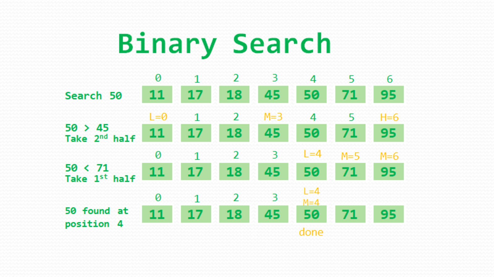

# Binary Search

Binary Search is a searching algorithm used in a sorted array by repeatedly dividing the search interval in half.

- Time Complexity: O (log n)
- Auxiliary Space: O (1)
- Auxiliary Space: O(log n), for using recursive stack space
