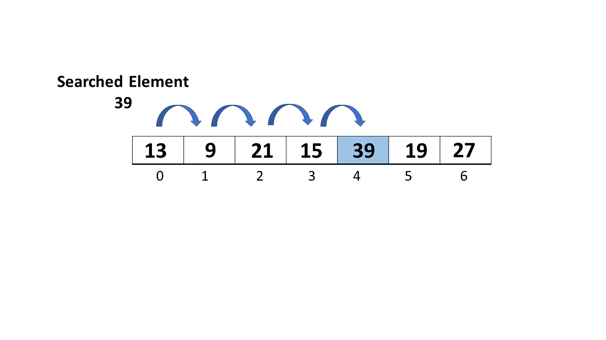

# Linear Search Algorithm

It is a **sequential search** algorithm that starts at one end and goes through each element of a list until the desired element is found, otherwise the search continues till the end of the data set.

- Time Complexity: O(N)
- Auxiliary Space: O(1)
- Auxiliary Space: O(N), for using recursive stack space
