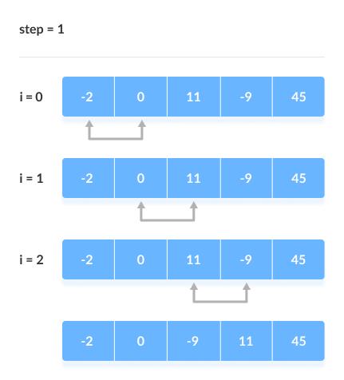

# Bubble Sort

- Bubble sort is a sorting algorithm that compares two adjacent elements and swaps them until they are in the intended order.
- It simpaly, Put the largest element at the end in each iteration.

## Optimized Bubble Sort:

- Bubble sort always runs O(N2) time even if the array is sorted. It can be optimized by stopping the algorithm if the inner loop didn’t cause any swap.
- We can introduce an extra variable swapped. The value of swapped is set true if there occurs swapping of elements. Otherwise, it is set false.
