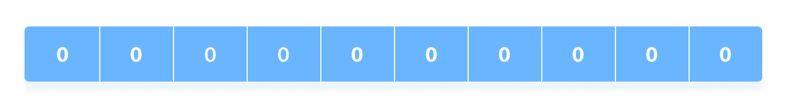
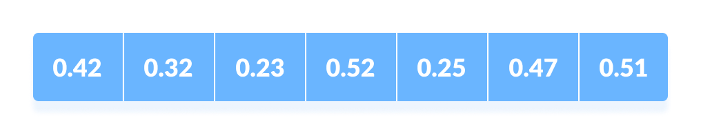
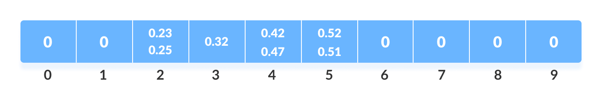
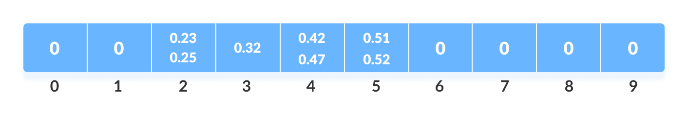

# Bucket sort

It divides the unsorted array elements into several groups called buckets. Each bucket is then sorted by using any of the suitable sorting algorithms or recursively applying the same bucket algorithm.

#### Scatter Gather Approach

The process of bucket sort can be understood as a scatter-gather approach. Here, elements are first scattered into buckets then the elements in each bucket are sorted. Finally, the elements are gathered in order.

#### Working

- Create an array of size 10. Each slot of this array is used as a bucket for storing elements.
  
  

- Insert elements according to the range of the bucket.
  

- The elements of each bucket are sorted using any of the stable sorting algorithms. Here, we have used inbuilt `sort()` function.
  

- bucket are gathered by iterating through the bucket and inserting every element into the original array in each cycle.
  

- Time Complexity : O(n2)

- Space Complexity : O(n + size)
