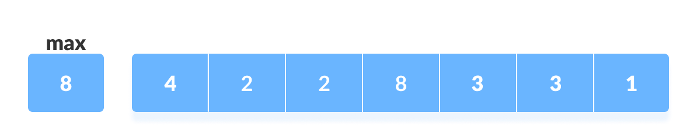
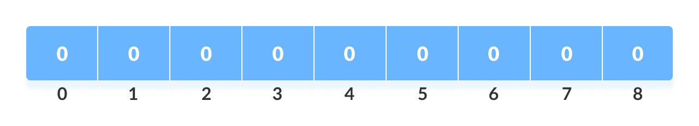
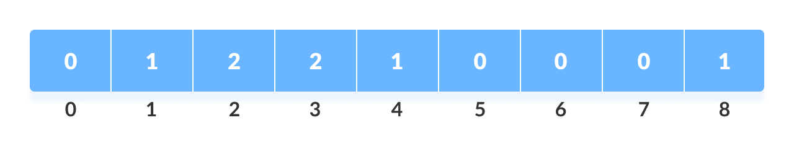
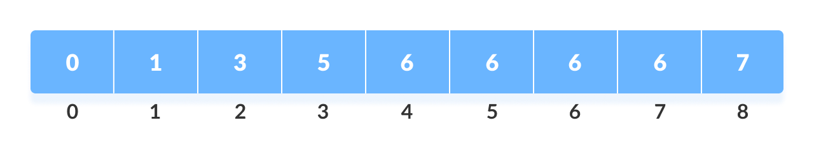

# Counting sort

It sorts the elements of an array by counting the number of occurrences of each unique element in the array.

- Find out the `max` value from the given array.
  

- Initialize an array of length `max+1` with all elements 0.
  

- Store the count of each element at their respective index in `count array`.
  

- Store cumulative sum of the elements of the count array. It helps in placing the elements into the correct index of the sorted array.
  

- Find the index of each element of the original array in count array, and place the elements in output array.
  

- After placing each element at its correct position, decrease its count by one.

- Time Complexity : O(n + max)

- Space Complexity : O(max)
