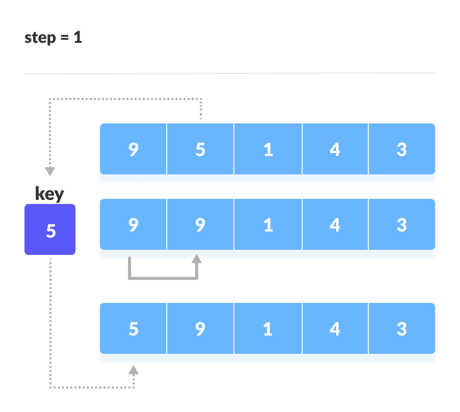

# Insertion sort

- It is a simple sorting algorithm that works similar to the way we sort playing cards in your hands.

- The array is virtually split into a sorted and an unsorted part.

- Values from the unsorted part are picked and placed at the correct position in the sorted part.

- Time Complexity: O(n2)

- Space complexity is O(1) because an extra variable key is used.

