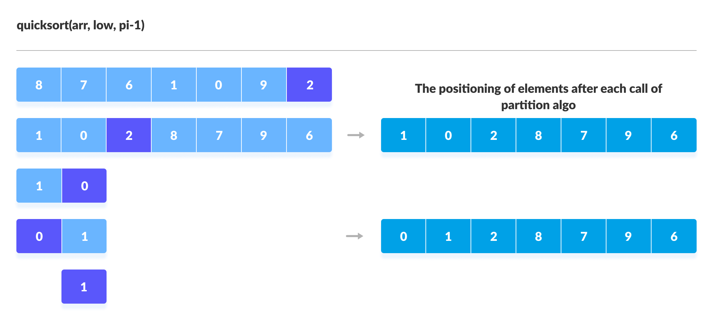
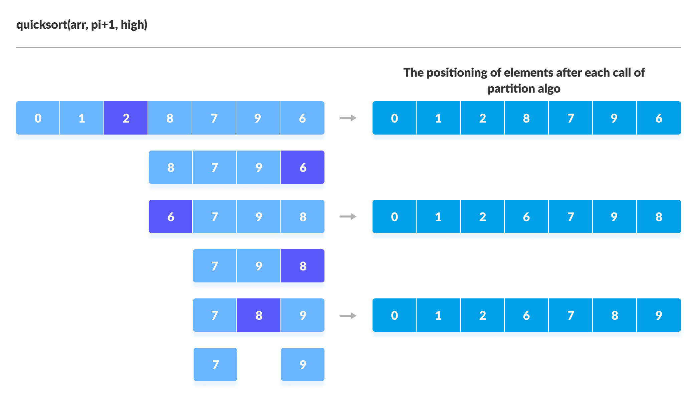

# Quicksort

- Quicksort is a sorting algorithm based on the divide and conquer approach.

- An array is divided into subarrays by selecting a pivot element.

- While dividing the array, the pivot element should be positioned in such a way that elements less than pivot are kept on the left side and elements greater than pivot are on the right side of the pivot.

- The left and right subarrays are also divided using the same approach. This process continues until each subarray contains a single element.

- At the end, elements are already sorted. Finally, elements are combined to form a sorted array.

- Time Complexity : O(n2) - When array is already sorted

- Space Complexity : O(log n)

