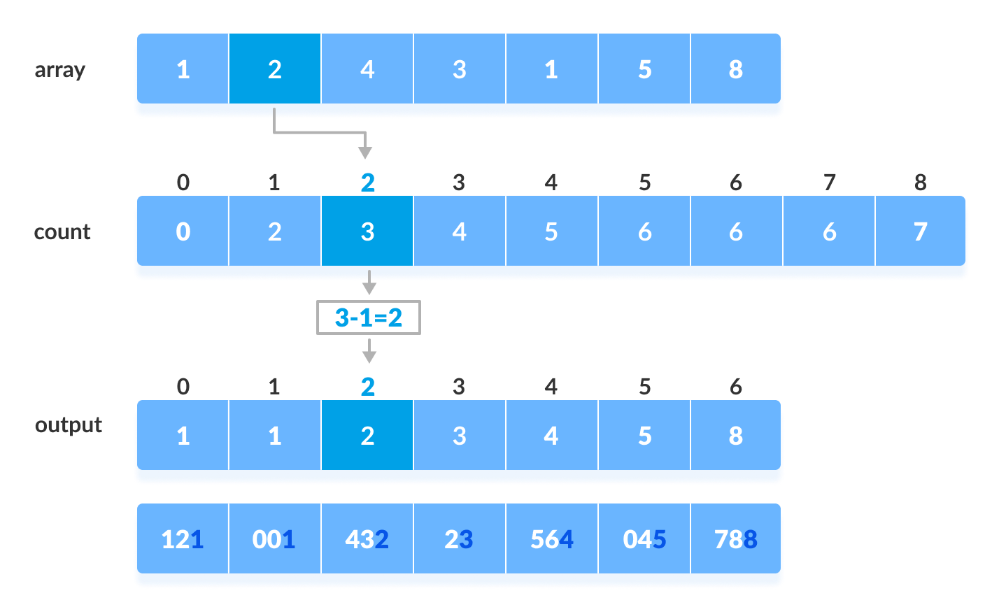
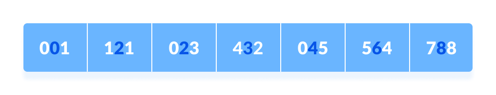
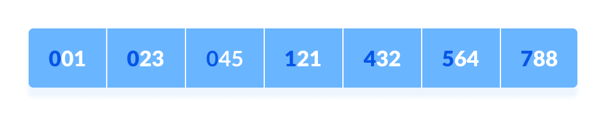

# Radix sort

It sorts the elements by first grouping the elements of the same place value. Then, sort the elements according to their increasing/decreasing order.

- Find the `max` element in the array. In this array 788 is the largest number. Therefore, the loop should go up to hundreds place (3 times).

- Now, go through each place one by one. Use any stable sorting technique to sort the digits. We have used counting sort for this.
  

- Now, sort the elements based on digits at tens place.
  

- Finally, sort the elements based on the digits at hundreds place.
  

- Time Complexity : O(n + max)

- Space Complexity : O(max)
