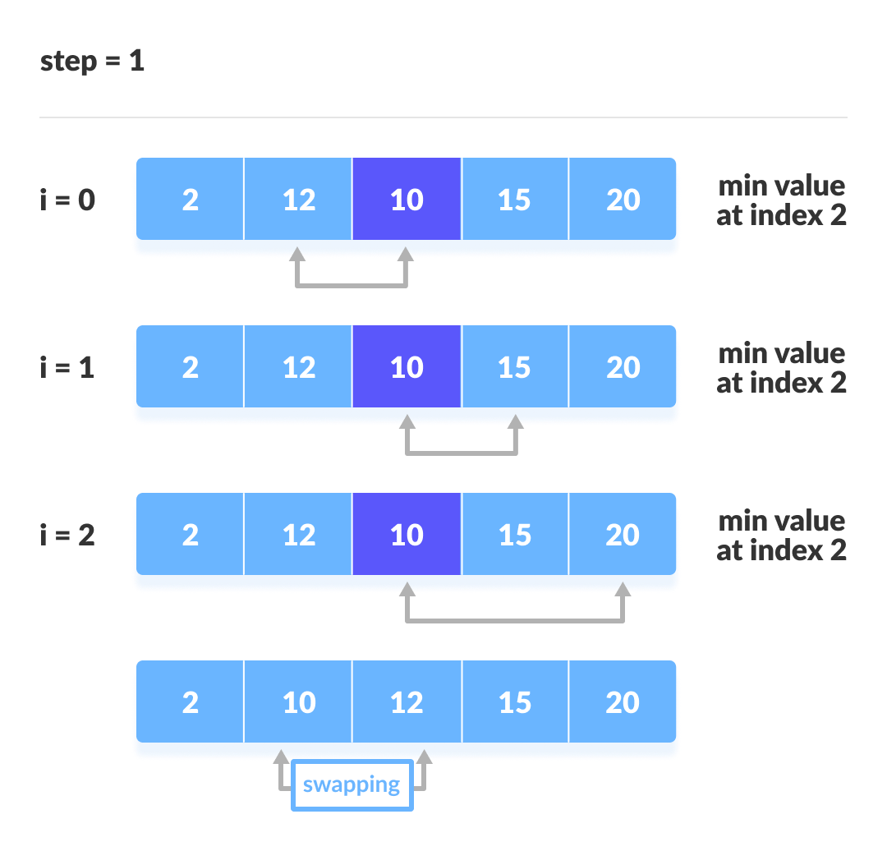
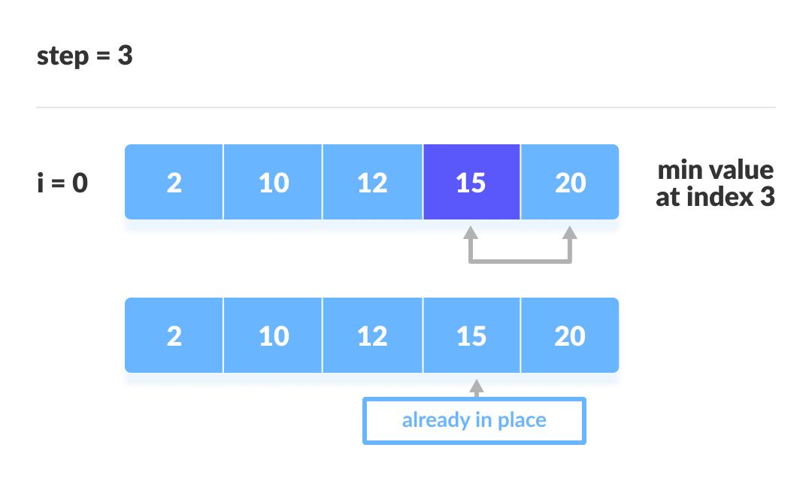

# Selection sort

- It selects the smallest element from an unsorted list in each iteration and places that element at the beginning of the unsorted list.
- This algorithm maintains two subarrays in a given array.
  - The subarray which already sorted.
  - The remaining unsorted subarray.
- Working
  - Set the first element as `min`.
  - Compare `min` with the 2nd element. If the 2nd element is smaller than `min`, assign the 2nd element as `min`.The process goes on until the last element.
  - After each iteration, `min` is placed in the front of the unsorted list.
- Time Complexity : O(n2)

- Space complexity : O(1)

