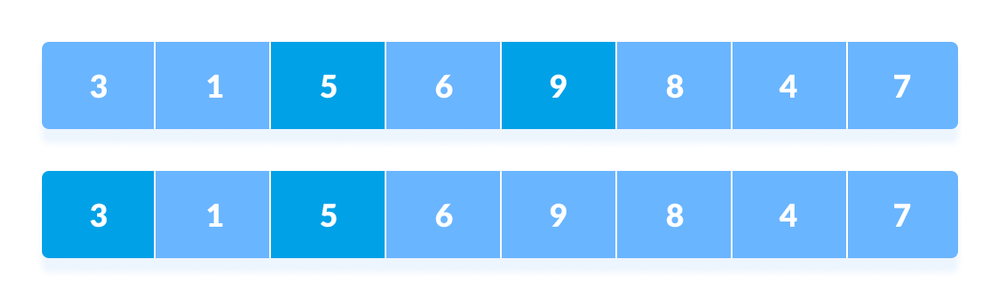
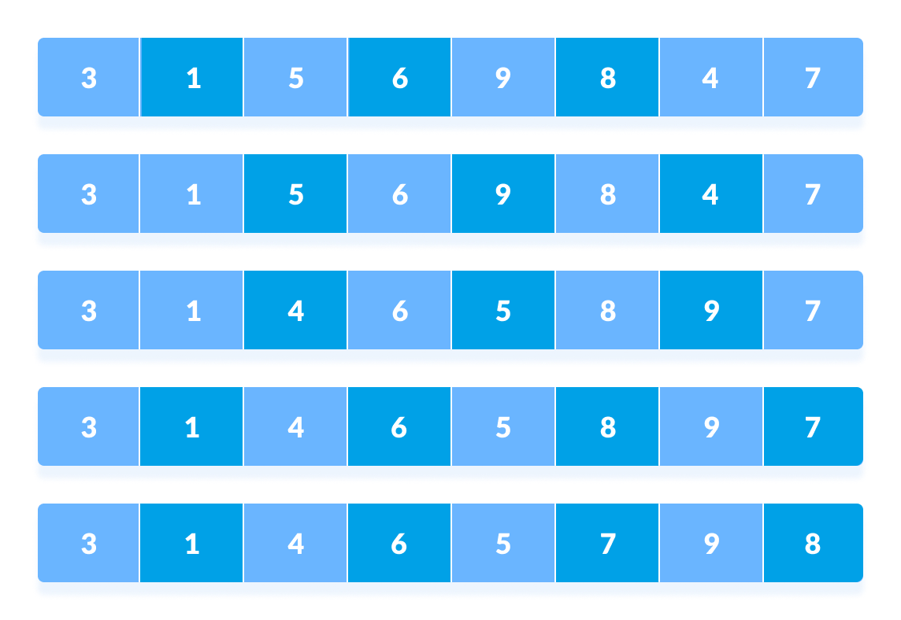

# Shell sort

Shell sort is a generalized version of the insertion sort algorithm. It first sorts elements that are far apart from each other and successively reduces the interval between the elements to be sorted.

- Suppose we are sorting this array
  

- In the first loop, if the array size is `N = 8` then, the elements lying at the interval of `N/2 = 4` are compared and swapped if they are not in order.
  
  

- In the second loop, an interval of `N/4 = 8/4 = 2` is taken and again the elements lying at these intervals are sorted.
  
  
  

- Finally, when the interval is N/8 = 8/8 =1 then the array elements lying at the interval of 1 are sorted. The array is now completely sorted.

- Time Complexity : O(n2)

- Space Complexity: O(1)
