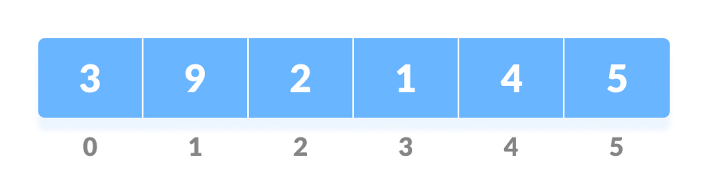
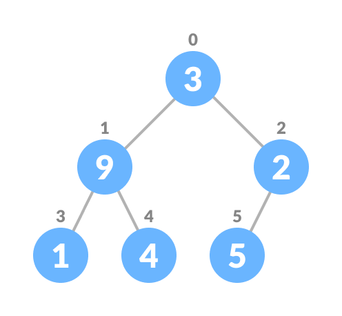
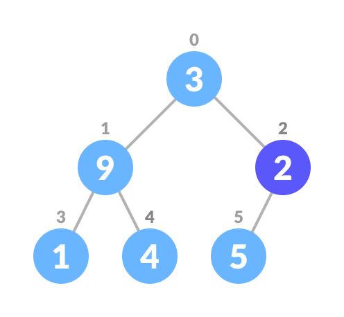
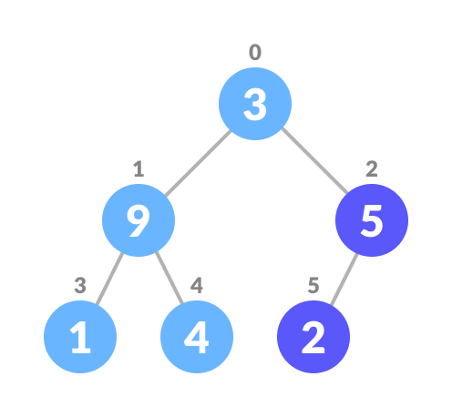

# Heap

Heap data structure is a complete binary tree that satisfies the heap property, where any given node is

- `max heap` : always greater than its child nodes and the key of the root node is the largest among all other nodes.
  

- `min heap` : always smaller than the child node/s and the key of the root node is the smallest among all other nodes.
  

#### Heapify

Heapify is the process of creating a heap data structure from a binary tree. It is used to create a Min-Heap or a Max-Heap.

- Let the input array be
  

- Create a complete binary tree from the array
  

- Start from the first index of non-leaf node whose index is given by n/2 - 1.
  

- Set current element i as largest.

- The index of left child is given by `2i + 1` and the right child is given by `2i + 2`.

- If `leftChild` is greater than `currentElement`, set `leftChildIndex` as largest. If `rightChild` is greater than element in largest, set `rightChildIndex` as largest.

- Swap largest with `currentElement`

  

- Repeat these steps untill we reach the root node.

#### Insert

To add a new element, we first check if the list is empty or not. If it is empty then push the element directly, else we will have to heapify the list after addition.

#### Delete

4 step process.

- Find the element in the array.
- Swap the element with the last element.
- Remove the last element.
- Heapify the list.

#### Delete max

Delete the root to remove the max. We can use the exisiting delete method for it.

```js
this.deleteMax = () => {
  this.delete(list[0]);
};
```
