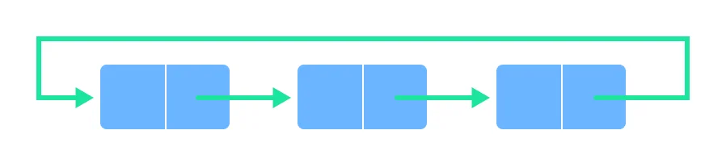

# Circular Queue

In a circular queue, the last element points to the first element making a circular link.

- The main advantage of a circular queue is better memory utilization. If the last position is full and the first position is empty, we can insert an element in the first position.

- This action is not possible in a simple queue.

#### Working

- Two pointers `FRONT` and `REAR` are maintained
- `FRONT` track the first element of the queue
- `REAR` track the last elements of the queue
- initially, set value of `FRONT` and `REAR` to -1
- Enqueue : increase the `REAR` index by 1
- Dequeue : increase the `FRONT` index by 1
