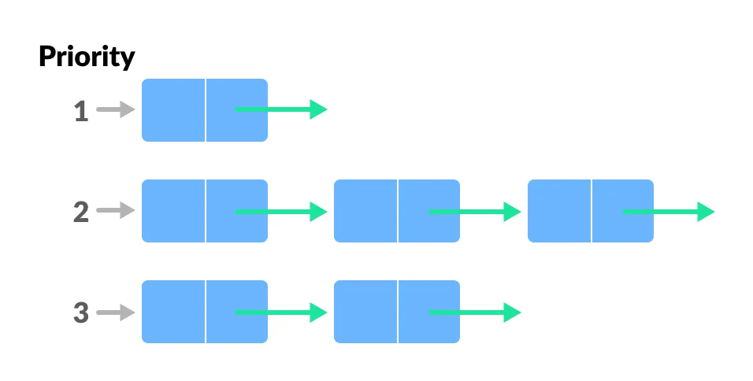

# Priority Queue

- In priority queue each element is associated with a priority and is served according to its priority.

- If elements with the same priority occur, they are served according to their order in the queue.

- `enqueue()`: It adds an element to the queue according to its priority.

- `dequeue()`: removes an element from the front of a queue as the highest priority element is stored at the front of the priority queue.
