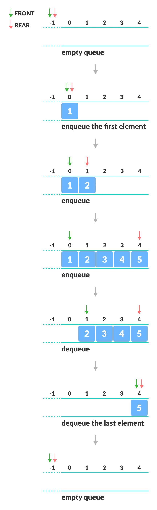

# Simple Queue

It is similar to the ticket queue outside a cinema hall, where the first person entering the queue is the first person who gets the ticket.

Queue follows the First In First Out (FIFO) rule - the item that goes in first is the item that comes out first.

#### Basic Operations

- `Enqueue`: Add an element to the end of the queue
- `Dequeue`: Remove an element from the front of the queue
- `IsEmpty`: Check if the queue is empty
- `Clear`: Remove all the items from queue
- `Peek`: Get the value of the front of the queue without removing it

