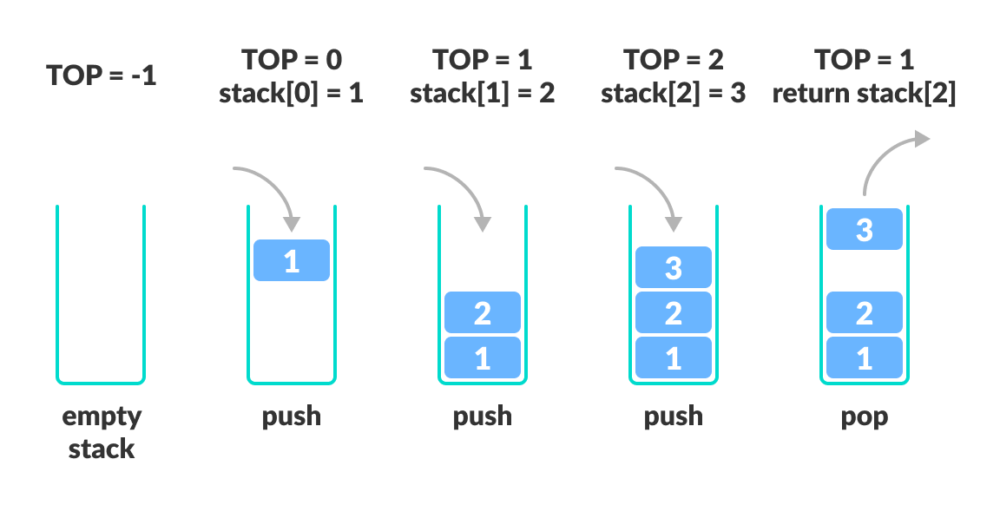

# Stack

A stack is a linear data structure that follows the principle of <b>Last In First Out (LIFO)</b>. This means the last element inserted inside the stack is removed first.

Stack representation similar to a pile of plate

#### LIFO Principle of Stack

In programming terms, putting an item on top of the stack is called push and removing an item is called pop.

#### Basic Operations (5)

- `Push` : Add an element to the top of a stack
- `Pop` : Remove an element from the top of a stack
- `IsEmpty` : Check if the stack is empty
- `IsFull` : Check if the stack is full
- `Peek` : Get the value of the top element without removing it

#### Working

- A pointer called `TOP` is used to keep track of the top element in the stack.
- When initializing the stack, we set its value to -1
- On pushing an element, we increase the value of `TOP`
- On popping an element, we return the element pointed to by `TOP` and reduce its value.
- Before pushing, we check if the stack is already full
- Before popping, we check if the stack is already empty

