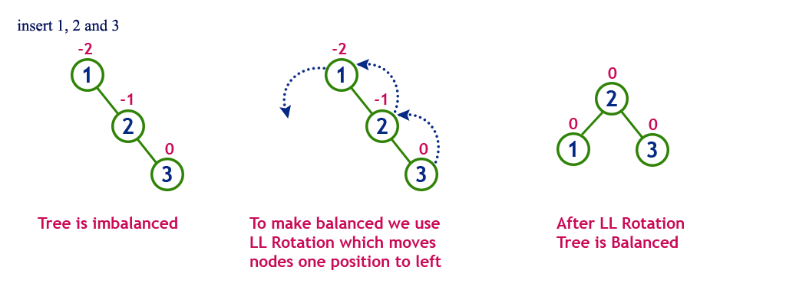

# AVL Tree

- AVL tree is a self-balancing binary search tree in which each node maintains extra information called a balance factor whose value is either -1, 0 or +1.

- Balance Factor = Height of Left Subtree - Height of Right Subtree
- Example :

- Lookup, insertion, and deletion all take `O(log n)` time in both the average and worst cases, where n is the number of nodes in the tree prior to the operation.

- Insertions and deletions may require the tree to be rebalanced by one or more tree rotations.

## AVL Tree Rotations

#### Left-Left Rotation

#### Right-Right Rotation

#### Left-Right Rotation

#### Right-Left Rotation

