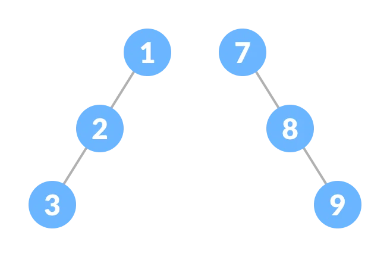
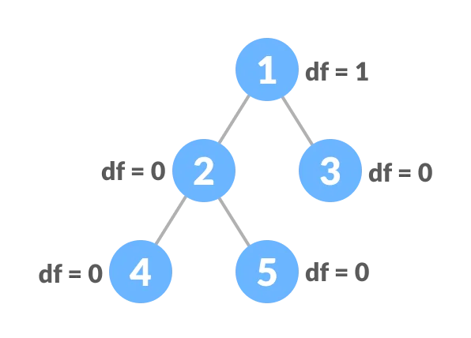

# Binary Tree

A binary tree is a tree data structure in which each parent node can have at most two children. Each node of a binary tree consists of three items:

### Types of Binary Tree

#### Full Binary Tree

Every parent node or internal node must have either two or no children.

#### Perfect Binary Tree

Every internal node has exactly two child nodes and all the leaf nodes are at the same level.

#### Complete Binary Tree

A complete binary tree is just like a full binary tree, but with two major differences

- Every level must be completely filled
- All the leaf elements must lean towards the left.
- The last leaf element might not have a right sibling ( i.e. a complete binary tree doesn't have to be a full binary tree ).

#### Degenerate or Pathological Tree

Tree having a single child either left or right.

#### Skewed Binary Tree

A degenerate tree in which the tree is either dominated by the left nodes or the right nodes.

#### Balanced Binary Tree

The difference between the height of the left and the right subtree for each node is either 0 or 1.

[Detail Link](https://javascript.plainenglish.io/leetcode-110-balanced-binary-tree-javascript-49ec9ddf9318)

### Binary Tree Representation

