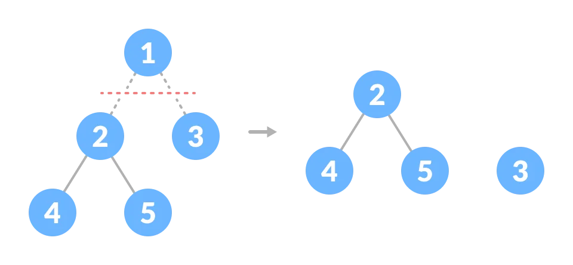

# Tree

A tree is a nonlinear hierarchical data structure that consists of nodes connected by edges.

#### Why Tree Data Structure?

In order to perform any operation in a linear data structure, the time complexity increases with the increase in the data size.

But different tree data structures allow quicker and easier access to the data as it is a non-linear data structure.

#### Tree Terminologies

##### Node

A node is an entity that contains a key or value and pointers to its child nodes.

##### Edge

It is the link between any two nodes.

##### Height of a Node

the longest path from the node to a leaf node.

##### Depth of a Node

The number of edges from the root to the node.

##### Degree of a Node

The degree of a node is the total number of branches of that node.

##### Forest

A collection of disjoint trees is called a forest. We can create a forest by cutting the root of a tree.

